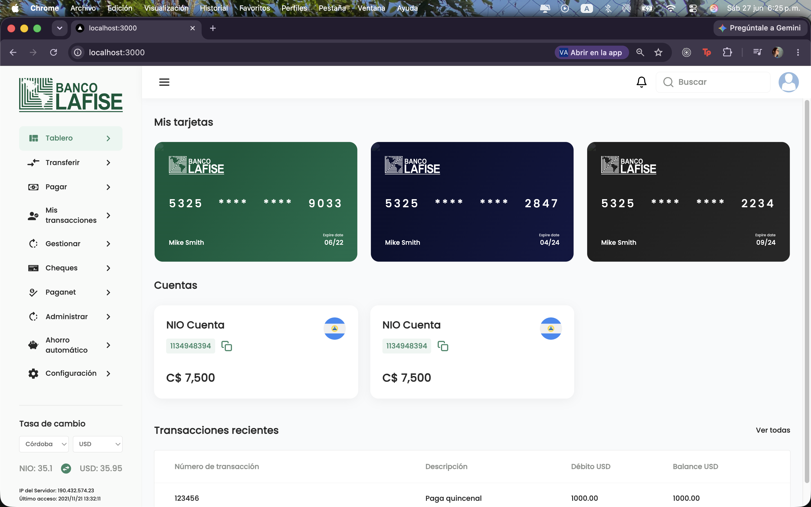
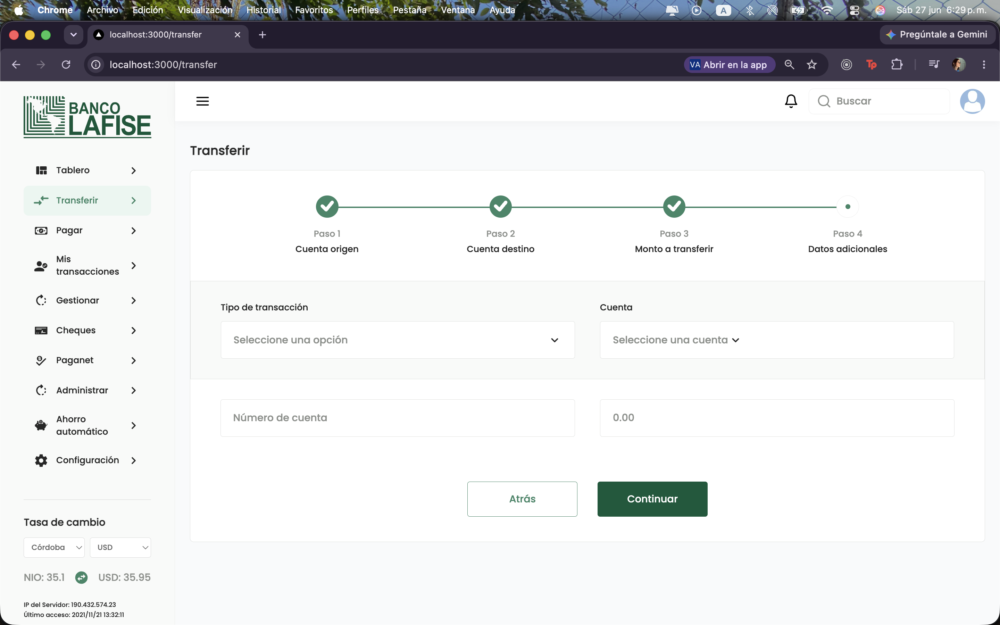
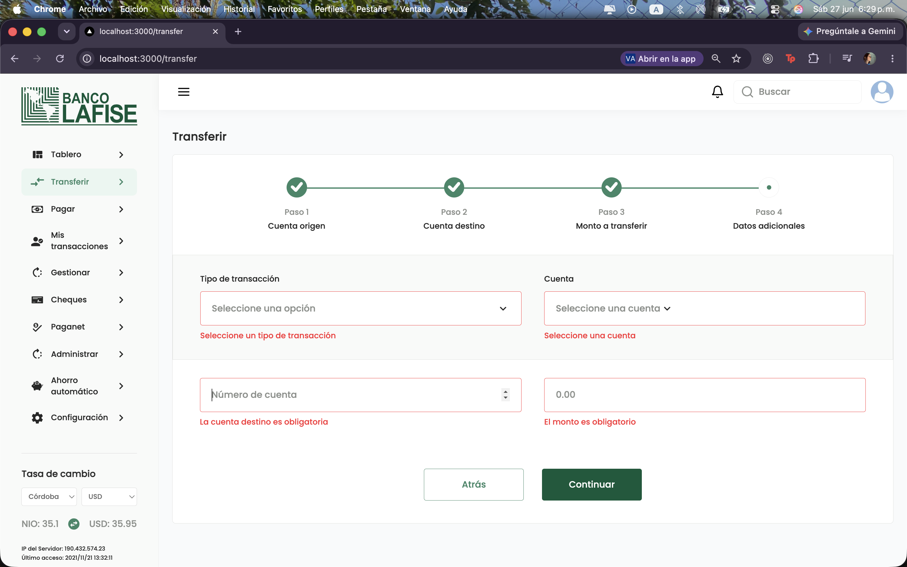
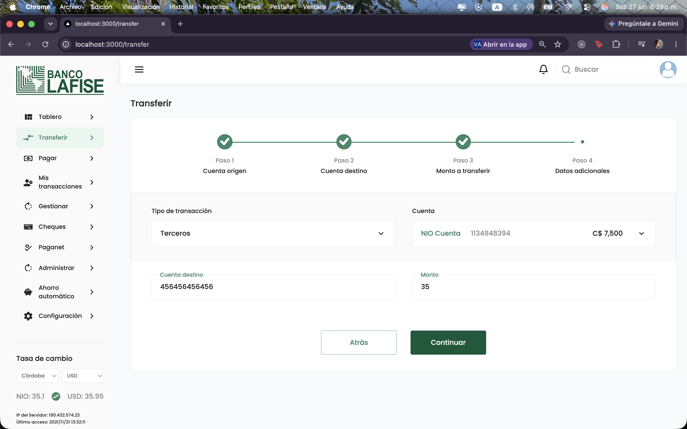
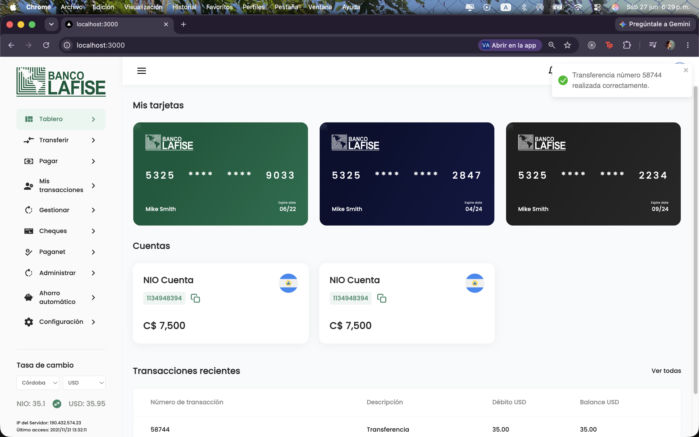
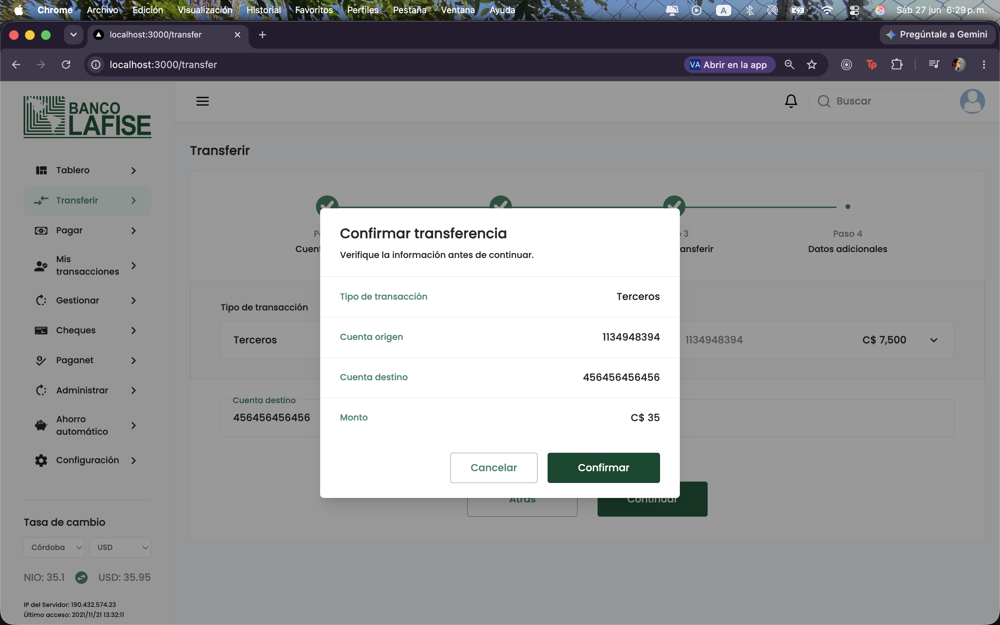
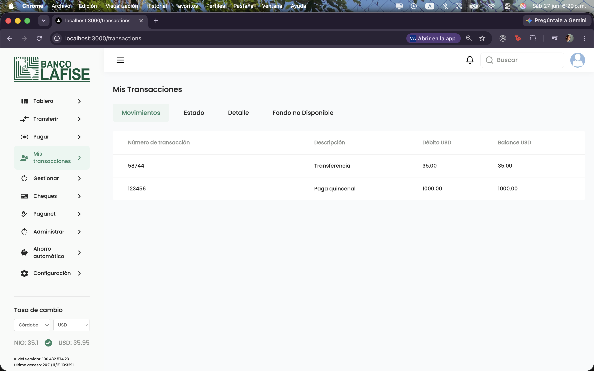

# 💳 Test Lafise Web

Aplicación desarrollada con **Next.js 16**, **React 19**, **TypeScript**, **TanStack Query**, **React Hook Form** y **Zustand** como parte de una prueba técnica para la gestión de cuentas bancarias y transferencias.

## Características

- Consulta de cuentas bancarias.
- Consulta de transacciones.
- Creación de transferencias entre cuentas.
- Confirmación de transferencia mediante modal.
- Validaciones de formularios.
- Estados de carga (Skeletons).
- Estados vacíos (Empty States).
- Notificaciones con React Toastify.
- Manejo de estado global con Zustand.
- Consumo de API mediante TanStack Query.

---

## Tecnologías utilizadas

- Next.js 16 (App Router)
- React 19
- TypeScript
- TailwindCSS
- React Hook Form
- TanStack Query
- Zustand
- Headless UI
- Lucide React
- React Toastify

---

## Instalación

Clonar el proyecto

```bash
git clone <https://github.com/NRivera07/test-lafise-web.git>
```

Entrar al proyecto

```bash
cd test-lafise-web
```

Instalar dependencias

```bash
npm install
```

Crear el archivo de variables de entorno

```env
NEXT_PUBLIC_API_URL=<api-url>
```

Ejecutar el proyecto

```bash
npm run dev
```

---

## Scripts

```bash
npm run dev
```

Inicia el servidor de desarrollo.

```bash
npm run build
```

Genera el build de producción.

```bash
npm run start
```

Ejecuta la aplicación compilada.

```bash
npm run lint
```

Ejecuta ESLint.

---

## Estructura del proyecto

```
app/
 ├── (dashboard)
        ├── transactions
        ├── transfer
 └── layout.tsx
 ├── page.tsx

components/
 ├── accounts
 ├── sections
 ├── layout
 ├── cards
 ├── transactions
 ├── transfer
 └── ui

data/

hooks/

providers/

services/

store/

types/
```

La aplicación sigue una arquitectura basada en responsabilidades:

- **components/** → Componentes de UI.
- **hooks/** → Hooks reutilizables para React Query.
- **services/** → Comunicación con la API.
- **store/** → Estado global mediante Zustand.
- **types/** → Tipado compartido.
- **providers/** → Providers globales.

---

## Manejo de estado

Se utilizan dos enfoques diferentes según la naturaleza de los datos.

### TanStack Query

Responsable de:

- Obtener cuentas.
- Obtener transacciones.
- Cachear información.
- Refetch automático.
- Manejo de estados de carga.

### Zustand

Responsable de:

- Información temporal de la transferencia.
- Transferencias creadas durante la sesión.

Esto permite mostrar inmediatamente una nueva transferencia aunque el servicio remoto no la devuelva.

---

## Formularios

Los formularios fueron implementados con **React Hook Form**, incluyendo:

- Campos requeridos.
- Validaciones personalizadas.
- Mensajes de error.
- Componentes reutilizables.
- Floating Labels.

---

## Componentes reutilizables

Se implementaron distintos componentes reutilizables, entre ellos:

- FloatingInput
- TransferStepper
- Modal de confirmación
- Skeletons
- Empty States
- Account Card
- Tables
- Listbox personalizados

---

## Manejo de errores

La aplicación utiliza **React Toastify** para informar al usuario cuando ocurre un error o una operación es exitosa.

Se notifican eventos como:

- Error de autenticación.
- Error al consultar datos.
- Error al realizar una transferencia.
- Transferencia realizada correctamente.

---

# Capturas de pantalla

### Dashboard

<p align="center">
  
</p>

### Nueva transferencia

<p align="center">
  
</p>
<p align="center">
  
</p>
<p align="center">
  
</p>
<p align="center">
  
</p>
<p align="center">
  
</p>

### Confirmación

<p align="center">
  
</p>

### Historial de transacciones

<p align="center">
  
</p>

---

## Autor

Desarrollado por **Nohelia Rivera** como parte de una prueba técnica utilizando buenas prácticas de arquitectura, separación de responsabilidades y componentes reutilizables.

- GitHub: https://github.com/NRivera07
- LinkedIn: https://www.linkedin.com/in/nohelia-rivera-14bb7b1b8/
